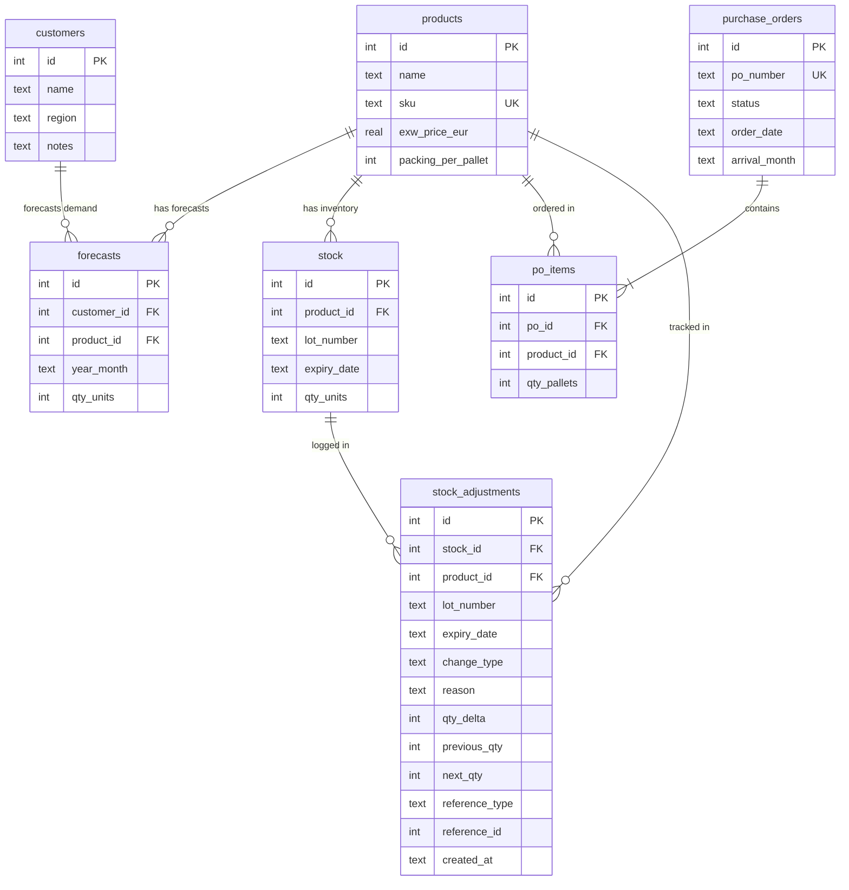
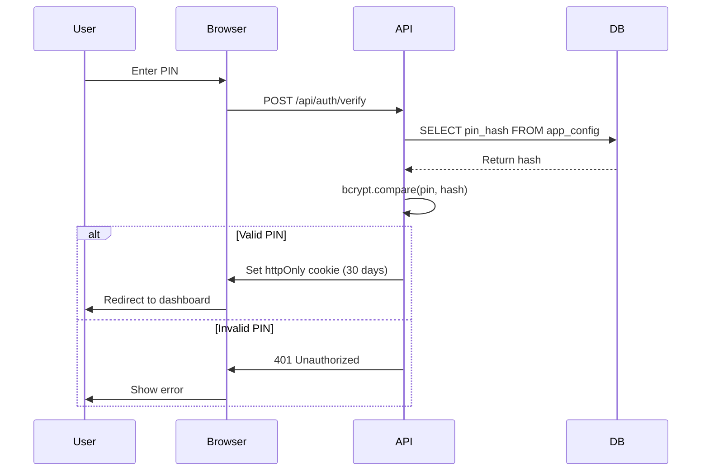
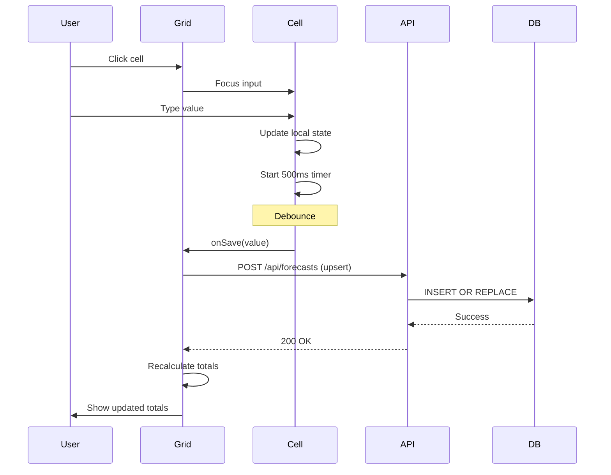
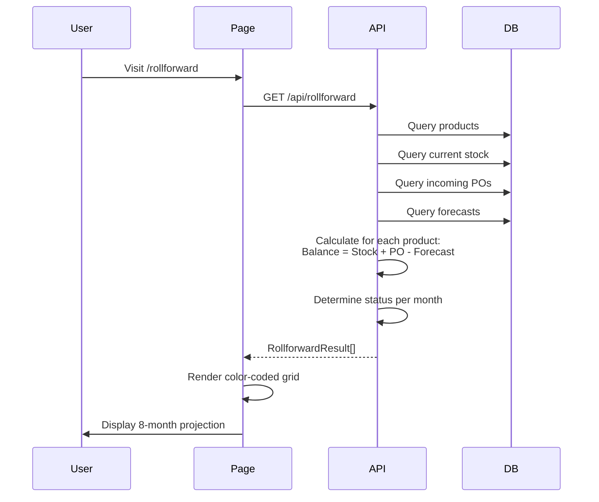
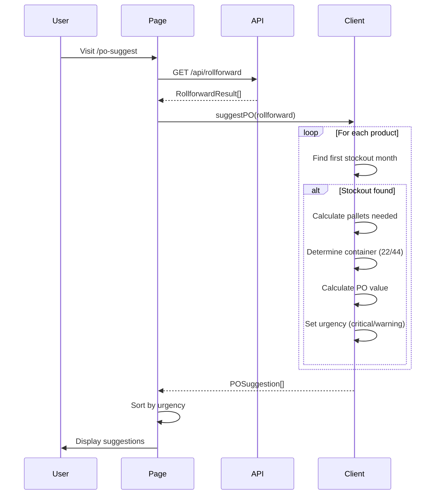
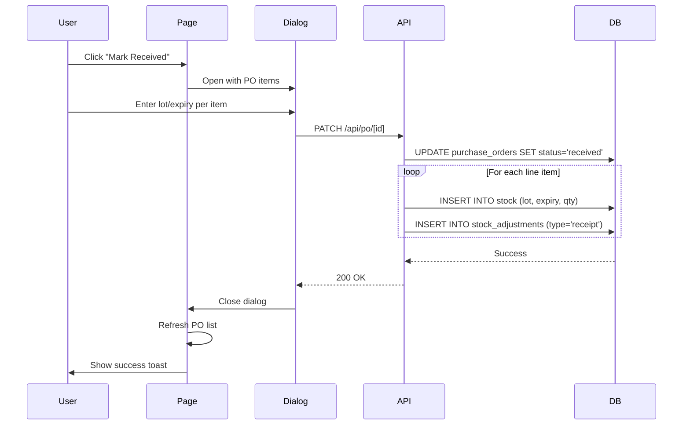

# System Architecture

**Project:** ICT-PO — Sale Stock & Purchase Order Management  
**Version:** 1.0.0  
**Last Updated:** 2026-05-04

---

## Overview

Cloud-based web application replacing Excel workflows for Exeol pharmaceutical distribution to Vietnamese hospitals. Single-user system (sale manager) with PIN-based authentication, providing automated stock forecasting, rollforward calculations, and intelligent purchase order suggestions.

**Key Characteristics:**
- Serverless architecture (Vercel + Turso)
- Single-page application with client-side routing
- Real-time calculations and updates
- Mobile-responsive design
- No external API dependencies

---

## High-Level Architecture

```mermaid
graph TB
    User[User Browser] -->|HTTPS| Vercel[Vercel Edge Network]
    Vercel -->|Route| NextJS[Next.js 16 App]
    NextJS -->|Server Components| Layout[Auth Layout]
    NextJS -->|Client Components| Pages[Interactive Pages]
    NextJS -->|API Routes| API[Serverless Functions]
    API -->|libSQL Protocol| Turso[(Turso Database)]
    
    Pages -->|Fetch| API
    API -->|Session Check| Session[Session Validation]
    Session -->|bcrypt| Turso
    
    style Vercel fill:#0070f3
    style NextJS fill:#000000
    style Turso fill:#4db8ff
```



---

## Technology Stack

### Frontend Layer

| Component | Technology | Version | Purpose |
|-----------|-----------|---------|---------|
| **Framework** | Next.js | 16.2.0 | React framework with App Router |
| **UI Library** | React | 19.2.4 | Component-based UI |
| **Language** | TypeScript | 5.x | Type-safe development |
| **Styling** | Tailwind CSS | 4.x | Utility-first CSS framework |
| **UI Components** | shadcn/ui | base-nova | Pre-built accessible components |
| **Icons** | Lucide React | 0.577.0 | Icon library |
| **Notifications** | Sonner | 2.0.7 | Toast notifications |
| **Theme** | next-themes | 0.4.6 | Dark mode support (not implemented) |

### Backend Layer

| Component | Technology | Version | Purpose |
|-----------|-----------|---------|---------|
| **Runtime** | Node.js | 22.x | JavaScript runtime |
| **API** | Next.js API Routes | 16.2.0 | Serverless functions |
| **Database Client** | @libsql/client | 0.17.0 | Turso SQLite client |
| **Authentication** | bcryptjs | 3.0.3 | PIN hashing |
| **Excel** | xlsx | 0.18.5 | Excel file generation |

### Infrastructure Layer

| Component | Technology | Purpose |
|-----------|-----------|---------|
| **Hosting** | Vercel | Application hosting, CDN, serverless functions |
| **Database** | Turso (libSQL) | Serverless SQLite database |
| **Region** | Frankfurt (fra1) | Closest to France (manufacturer) and Vietnam (market) |
| **CDN** | Vercel Edge Network | Global content delivery |

---

## Database Architecture

### Schema Overview

**Total:** 7 tables, 10 indexes, 3 foreign key relationships



### Table Descriptions

**app_config**
- Key-value store for application settings
- Currently stores only PIN hash
- No foreign keys

**products**
- Master product catalog (25 Exeol pharmaceuticals)
- SKU is unique identifier
- EXW price in EUR
- Packing per pallet for container calculations

**customers**
- Hospital customer list (10 Vietnamese hospitals)
- Region: MB (Northern), MN (Central), MN-South
- Notes field for additional information

**forecasts**
- Monthly demand forecasts
- Composite unique key: (customer_id, product_id, year_month)
- Supports 8-month rolling window

**stock**
- Current inventory with lot tracking
- Lot number and expiry date for pharmaceutical compliance
- Multiple lots per product supported

**stock_adjustments**
- Immutable audit trail for all stock changes
- Change types: create, update, delete, receipt
- Nullable stock_id (survives parent deletion)
- Reference to related entity (e.g., PO)

**purchase_orders**
- PO header with status lifecycle
- Status: ordered, confirmed, in_transit, received
- Arrival month calculated from order date + 5 months

**po_items**
- PO line items (product × pallets)
- Cascade delete when PO is deleted
- Pallets converted to units using packing_per_pallet

### Index Strategy

**Forecasts:**
- `idx_forecasts_product_month` — (product_id, year_month)
- `idx_forecasts_customer` — (customer_id)
- `idx_forecasts_month` — (year_month)

**Stock:**
- `idx_stock_product` — (product_id)

**Stock Adjustments:**
- `idx_stock_adjustments_product_created` — (product_id, created_at)
- `idx_stock_adjustments_stock` — (stock_id)

**Purchase Orders:**
- `idx_po_items_po` — (po_id)
- `idx_po_items_product` — (product_id)
- `idx_po_items_arrival` — (arrival_month)
- `idx_po_status` — (status)

---

## API Architecture

### Endpoint Overview

**Total:** 15 API routes, all serverless functions

```
/api/
├── init                        # Database auto-migration
├── auth/
│   ├── setup                  # POST: Create PIN
│   ├── verify                 # POST: Verify PIN
│   └── reset-pin              # POST: Reset PIN
├── products/
│   ├── [root]                 # GET: List, POST: Create/Bulk
│   └── [id]                   # GET: Read, PUT: Update, DELETE: Delete
├── customers/
│   ├── [root]                 # GET: List, POST: Create/Bulk
│   └── [id]                   # GET: Read, PUT: Update, DELETE: Delete
├── forecasts                   # GET: Query, POST: Upsert
├── stock/
│   ├── [root]                 # GET: List, POST: Create
│   ├── [id]                   # PUT: Update, DELETE: Delete
│   └── adjustments            # GET: History
├── po/
│   ├── [root]                 # GET: List, POST: Create
│   └── [id]                   # GET: Read, PUT: Update, DELETE: Delete, PATCH: Receive
└── rollforward                 # GET: Calculate 8-month projection
```

### Authentication Flow



### Request/Response Pattern

**Standard Request:**
```typescript
// Client
const res = await fetch("/api/products", {
  method: "POST",
  headers: { "Content-Type": "application/json" },
  body: JSON.stringify({ name, sku, exw_price_eur, packing_per_pallet })
})

// Server
export async function POST(req: NextRequest) {
  // 1. Auth check
  if (!(await hasValidRequestSession(req))) {
    return NextResponse.json({ error: "Unauthorized" }, { status: 401 })
  }
  
  // 2. Parse body
  const body = await req.json()
  
  // 3. Validate
  if (!body.name || !body.sku) {
    return NextResponse.json({ error: "Missing fields" }, { status: 400 })
  }
  
  // 4. Execute
  await executeSql("INSERT INTO products ...", [...])
  
  // 5. Respond
  return NextResponse.json({ success: true }, { status: 201 })
}
```

---

## Component Architecture

### Component Hierarchy

```
App Layout (Server)
├── Root Layout (fonts, theme)
└── Auth Layout (PIN check, DB init)
    ├── Sidebar (Client)
    │   └── Navigation Links
    └── Page Content
        ├── Dashboard (Client)
        ├── Forecasts (Client)
        │   └── ForecastEntryTable
        ├── Rollforward (Client)
        ├── PO Suggest (Client)
        ├── PO Management (Client)
        ├── Stock Control (Client)
        │   ├── StockControlWorkspace
        │   └── StockAdjustmentHistory
        ├── Master Data (Client)
        │   ├── MasterDataWorkspace
        │   ├── ProductsManager
        │   └── CustomersManager
        └── Settings (Client)
```

### Client vs Server Components

**Server Components:**
- Root layout (fonts, metadata)
- Auth layout (session check, DB init)
- Static UI primitives (Card, Badge, Skeleton)

**Client Components:**
- All interactive pages
- All feature components
- Navigation (Sidebar)
- UI primitives with interactivity (Button, Input, Dialog, etc.)

**Rationale:** Interactivity requires client-side JavaScript. Server components used only for auth/layout.

---

## Data Flow Architecture

### Forecast Entry Flow



### Rollforward Calculation Flow



### PO Suggestion Flow



### PO Receipt Flow



---

## Business Logic Architecture

### Rollforward Algorithm

**Location:** `/api/rollforward` (server-side)

**Pseudocode:**
```
For each product:
  1. Get current stock total (sum of all lots)
  2. For each month (1-8):
     a. Get incoming PO units for that month
     b. Get forecast units for that month
     c. Calculate balance = stock + incoming - forecast
     d. Determine status based on balance vs packing thresholds
     e. Update stock for next month (stock = balance)
  3. Return 8-month projection
```

### PO Suggestion Algorithm

**Location:** `lib/calculations.ts` (client-side)

**Pseudocode:**
```
Input: RollforwardResult (8-month projection)

1. Find first month where balance < 0
2. If no stockout → return null
3. Calculate shortfall = abs(negative balance)
4. Calculate pallets = ceil(shortfall / packing_per_pallet)
5. Determine container:
   - If pallets ≤ 22 → 22-pallet container
   - If pallets ≤ 44 → 44-pallet container
   - If pallets > 44 → "mixed" (multiple containers)
6. Calculate PO value = pallets × packing × exw_price_eur
7. Set urgency:
   - If stockout ≤ 2 months → "critical"
   - Else → "warning"
8. Return POSuggestion object
```

### Status Determination

**Location:** `lib/calculations.ts`

**Thresholds:**
```typescript
if (balance < 0) return "stockout"           // Red
if (balance < packing × 1) return "critical" // Orange (< 1 pallet)
if (balance < packing × 3) return "low"      // Yellow (< 3 pallets)
return "ok"                                   // Green (≥ 3 pallets)
```

---

## Security Architecture

### Authentication

**Method:** PIN-based (6-digit numeric)
- bcrypt hashing with salt rounds
- Hash stored in `app_config` table
- No hardcoded credentials

**Session Management:**
- httpOnly cookies (JavaScript cannot access)
- 30-day expiration
- Secure flag in production (HTTPS only)
- SameSite=Lax (CSRF protection)

### Authorization

**Single-User Model:**
- No role-based access control
- All authenticated users have full access
- No user management features

### API Security

**Request Validation:**
- All `/api/*` routes check session cookie
- Unauthorized requests return 401
- Missing fields return 400
- Not found returns 404

**SQL Injection Prevention:**
- Parameterized queries throughout
- No string concatenation in SQL
- Type-safe query utilities

**Headers:**
```
Cache-Control: no-store, must-revalidate
X-Content-Type-Options: nosniff
```

---

## Deployment Architecture

### Vercel Configuration

**Region:** Frankfurt (fra1)
- Closest to France (manufacturer)
- Low latency for European users

**Serverless Functions:**
- Runtime: Node.js 22.x
- Memory: 512 MB per function
- Timeout: 10 seconds
- Cold starts: Expected on free tier

**Build Configuration:**
```json
{
  "framework": "nextjs",
  "buildCommand": "npm run build",
  "devCommand": "npm run dev",
  "installCommand": "npm install"
}
```

### Database Configuration

**Turso (libSQL):**
- Serverless SQLite
- Free tier: 500 MB storage, 1B row reads/month
- No edge replication (single region)
- Automatic backups

**Connection:**
```typescript
const client = createClient({
  url: process.env.TURSO_DATABASE_URL,
  authToken: process.env.TURSO_AUTH_TOKEN
})
```

**Fallback:** If env vars missing, uses `file:local.db` for local development

---

## Performance Considerations

### Optimizations

**Database:**
- Singleton client (connection pooling)
- Indexed queries for common patterns
- Composite indexes for multi-column queries

**Frontend:**
- Deferred search queries (prevents blocking)
- Debounced cell edits (reduces API calls)
- Expandable rows (reduces initial DOM size)
- Client-side Excel generation (offloads server)

**Caching:**
- Static assets cached by Vercel CDN
- API routes: `Cache-Control: no-store` (data freshness)
- No application-level caching

### Bottlenecks

**Identified:**
- Vercel cold starts (free tier)
- Large Excel exports (client-side memory)
- Rollforward calculation for many products
- Stock adjustment queries without date limits

**Mitigation:**
- Accept cold starts (free tier limitation)
- Limit Excel export to reasonable data sizes
- Optimize rollforward SQL queries
- Add date range filters to adjustment history

---

## Scalability Limits

### Current Capacity

**Products:** 25 (tested), supports up to 100
**Customers:** 10 (tested), supports up to 50
**Forecasts:** 2,000 entries (10 × 25 × 8), supports up to 40,000
**POs:** Unlimited (within database limits)
**Stock Lots:** Unlimited (within database limits)

### Turso Free Tier Limits

- **Storage:** 500 MB
- **Row Reads:** 1 billion/month
- **Row Writes:** Unlimited
- **Databases:** 3 databases

**Estimated Usage:**
- Products: 25 rows × 200 bytes = 5 KB
- Customers: 10 rows × 150 bytes = 1.5 KB
- Forecasts: 2,000 rows × 100 bytes = 200 KB
- Stock: 100 rows × 150 bytes = 15 KB
- POs: 100 rows × 200 bytes = 20 KB
- **Total:** < 1 MB (well within limits)

---

## Monitoring & Observability

**Current State:** Minimal monitoring

**Available:**
- Vercel deployment logs
- Vercel function logs
- Browser console errors
- Turso query logs (via CLI)

**Not Implemented:**
- Error monitoring (Sentry, etc.)
- Performance monitoring (APM)
- User analytics
- Uptime monitoring
- Alert system

---

## Disaster Recovery

**Backup Strategy:**
- Manual JSON export from Settings page
- Recommended: Weekly backups
- No automated backup system

**Recovery Process:**
1. Create new Turso database
2. Run migrations (automatic on first request)
3. Manually re-enter data or import from JSON backup

**Data Loss Risk:** High if user doesn't perform regular backups

---

## Future Architecture Considerations

**Potential Enhancements:**
1. **Multi-User Support:** Add user accounts, roles, permissions
2. **Real-Time Updates:** WebSocket for collaborative editing
3. **Edge Replication:** Turso edge replicas for global performance
4. **Caching Layer:** Redis for frequently accessed data
5. **Background Jobs:** Queue system for long-running tasks
6. **Email Notifications:** Automated stockout alerts
7. **Mobile App:** React Native with shared business logic
8. **API Gateway:** Rate limiting, request validation
9. **Monitoring:** Sentry for errors, Vercel Analytics for usage
10. **Automated Backups:** Scheduled database exports to S3

---

**Document Owner:** Development Team  
**Review Cycle:** Quarterly or on major architecture changes
